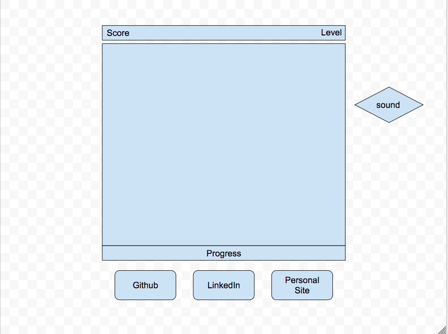

# BeSparkly
Tile-matching game (inspired by Bejeweled)

# Functionality & MVP
* Allows player to switch placement of two tiles (jewels) and earn points for matching rows.
* New game board populates with jewel objects
* Generates new tiles, drops row into empty spaces
* Keeps score
* Shimmering animation
* Levels increasing in difficulty

# Technologies, Libraries, APIs
Javascript, HTML, CSS, Canvas

# Wireframe

# Backend
* At least 6 types of jewels to match
* Different points awarded for number of jewels in a row
* Extra points for intersecting rows
* Bonus objects

# Implementation Timeline
* Day 1: Score, board grid
* Day 2: Pieces
* Day 3: Front end styling

# Bonus
Zen mode - no score, looping animation mimicking slow breathing pattern
